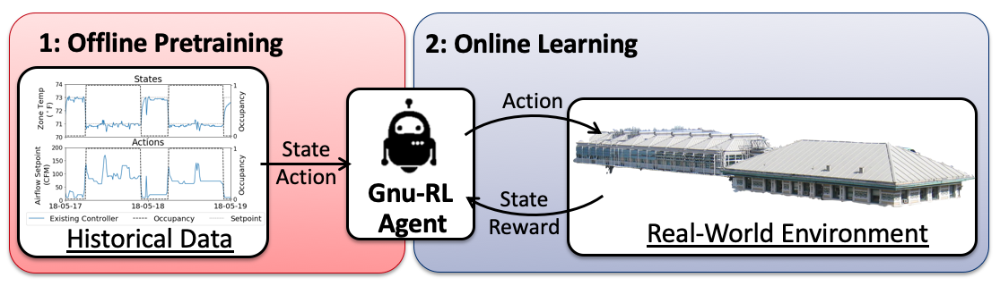
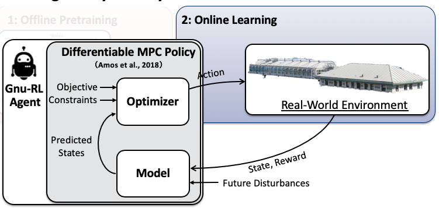

# Gnu-RL

This is the companion code repository for [Gnu-RL: A Precocial Reinforcement Learning Solution for Building HVAC Control Using a Differentiable MPC Policy](https://dl.acm.org/citation.cfm?id=3360849). If our paper is helpful to your research, cite us [here](https://scholar.googleusercontent.com/scholar.bib?q=info:Whs_iSYeXh4J:scholar.google.com/&output=citation&scisdr=CgUBk9UIEICerh8cpCI:AAGBfm0AAAAAXdMZvCKyQM-7eUa6T_rmfFyaU7BFiCdj&scisig=AAGBfm0AAAAAXdMZvOG40qtz4XWoUVABW6qbbmVY-HIa&scisf=4&ct=citation&cd=-1&hl=en).
 
### Description
Gnu-RL is a novel approach that enables practical deployment of reinforcement learning (RL) for heating, ventilation, and air conditioning (HVAC) control and requires no prior information other than historical data from existing HVAC controllers. 

Prior to any interaction with the environment, a Gnu-RL agent is pre-trained on historical data using imitation learning, which enables it to match the behavior of the existing controller. Once it is put in charge of controlling the environment, the agent continues to improve its policy end-to-end, using a policy gradient algorithm.



Specifically, Gnu-RL adopts a recently-developed [Differentiable Model Predictive Control (MPC)](http://papers.nips.cc/paper/8050-differentiable-mpc-for-end-to-end-planning-and-control.pdf) policy, which encodes domain knowledge on planning and system dynamics, making it both sample-efficient and interpretable. 



### Installation
The following two packages were used. Install following their documentation.    
- [Gym-Eplus](https://github.com/zhangzhizza/Gym-Eplus)
    - This package is an OpenGym AI wrapper for EnergyPlus. 
    - The demonstration in this repo uses EnergyPlus version 8.6, but the Gym-plus package is applicable to any EnergyPlus version 8.x.  
- [mpc.torch](https://github.com/locuslab/mpc.pytorch)
    - This package is a fast and differentiable model predictive control solver for PyTorch.

Install other packages by, 
```
$ pip install -r requirements.txt
``` 
(To be Confirmed)

### Set up Simulation Environments
We demonstrate Gnu-RL in an EnergyPlus model. Check [here](Demo.ipynb) for details.

To set up the co-simulation environment with EnergyPlus: 
- Read the documentation of [Gym-Eplus](https://github.com/zhangzhizza/Gym-Eplus) on setting up simulation environments. 
- Place the model and weather files in the *eplus_env* folder under the corresponding location in the Gym-Eplus folder. 
- Register the environments following this table. A  *\_\_init\_\_.py* for registeration is included. But, check that it matches your own file placement. 
 
| **Environment Name** |**Model File (\*.idf)**|**Configuration File (\*.cfg)**|**Weather File (\*.epw)**| 
|:----------------|:---------------|:--------|:-----------|
|**5Zone-sim_TMY2-v0**|5Zone_Default.idf|variables_Default.cfg|pittsburgh_TMY2.epw|
|**5Zone-control_TMY3-v0**|5Zone_Control.idf|variables_Control.cfg|pittsburgh_TMY3.epw|
| **5Zone-sim_TMY3-v0**   | 5Zone_Default.idf|variables_Default.cfg|pittsburgh_TMY3.epw|

### Files
For **Offline Pretraining**, 
```
$ python Imit_EP.py
```

For **Online Learning**, 
```
$ python PPO_MPC_EP.py
``` 

### Contact
- [Bingqing Chen](mailto:bingqinc@andrew.cmu.edu), PhD Candidate at Carnegie Mellon University, Department of Civil and Environmental Engineering, Intelligent Infrastructure Research Laboratory (INFERLab).
- [Mario Berges](mailto:marioberges@cmu.edu), Professor at Carnegie Mellon University, Department of Civil and Environmental Engineering, INFERLab

### License
Copyright (c) 2019 Bingqing Chen

Permission is hereby granted, free of charge, to any person obtaining a copy
of this software and associated documentation files (the "Software"), to deal
in the Software without restriction, including without limitation the rights
to use, copy, modify, merge, publish, distribute, sublicense, and/or sell
copies of the Software, and to permit persons to whom the Software is
furnished to do so, subject to the following conditions:

The above copyright notice and this permission notice shall be included in all
copies or substantial portions of the Software.

THE SOFTWARE IS PROVIDED "AS IS", WITHOUT WARRANTY OF ANY KIND, EXPRESS OR
IMPLIED, INCLUDING BUT NOT LIMITED TO THE WARRANTIES OF MERCHANTABILITY,
FITNESS FOR A PARTICULAR PURPOSE AND NONINFRINGEMENT. IN NO EVENT SHALL THE
AUTHORS OR COPYRIGHT HOLDERS BE LIABLE FOR ANY CLAIM, DAMAGES OR OTHER
LIABILITY, WHETHER IN AN ACTION OF CONTRACT, TORT OR OTHERWISE, ARISING FROM,
OUT OF OR IN CONNECTION WITH THE SOFTWARE OR THE USE OR OTHER DEALINGS IN THE
SOFTWARE.


